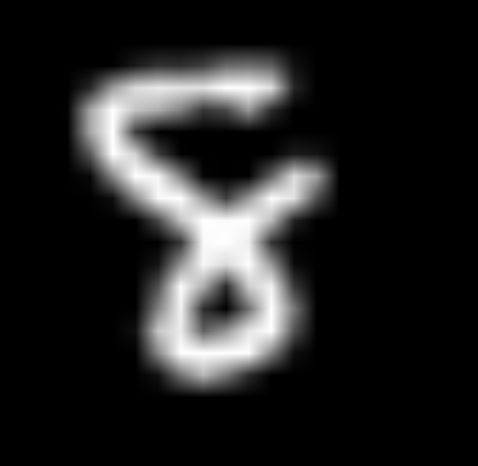
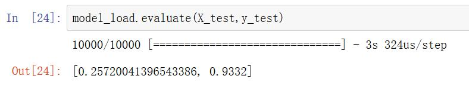

# 用keras实现MLP分类手写数字

## ***实验目标***
    用keras搭建多层神经网络，对来自mnist数据集的手写数字进行分类训练
    学会保存训练与加载模型，以及使用OpenCV读取图像，进行处理后进行
    分类实验，引用的库如下

```python
import keras
from keras.datasets import mnist #引入数据集
import matplotlib.pyplot as plt #绘图以及显示
import numpy as np
from keras.utils import np_utils #对目标标签进行one_hot编码
from keras.layers import Dense  #网络搭建
from keras.models import Sequential
from keras.layers import Activation
from keras.layers import MaxPool2D,Dropout,Flatten
from keras.optimizers import SGD
from keras.models import load_model #加载训练模型
import cv2
```

## **测试图像**




**Parameters**

| 参数  | 描述                        | 值 |
| --------- | ----------------------------------- | --- |
| 图像尺寸  | mnist图像的尺寸                  | 28x28  |
| input_shape  | 输入网络的张量大小            | 28x28x1 |
| n_classes | 类别数                           | 10 |

## **测试结果**
    网络性能


    OpenCV读入图像测试


